# NoorReader Navigation Diagrams

> Visual flowcharts rendered with Mermaid (GitHub-compatible)

---

## Table of Contents

1. [High-Level App Structure](#high-level-app-structure)
2. [Main Window Layout](#main-window-layout)
3. [Library Flow](#library-flow)
4. [Reader Flow](#reader-flow)
5. [Annotation Flow](#annotation-flow)
6. [AI Features Flow](#ai-features-flow)
7. [Study Tools Flow](#study-tools-flow)
8. [Islamic Reminders Flow](#islamic-reminders-flow)
9. [Settings Structure](#settings-structure)
10. [iOS Navigation](#ios-navigation)

---

## High-Level App Structure

```mermaid
flowchart TB
    subgraph App["🖥️ NoorReader App"]
        Launch["App Launch"] --> Dua["Launch Dua Banner<br/>(3s auto-dismiss)"]
        Dua --> Main["Main Window"]

        Main --> Library["📚 Library View"]
        Main --> Reader["📖 Reader View"]
        Main --> Settings["⚙️ Settings Window"]

        Library <--> Reader

        Reader --> Modals["📊 Modals/Sheets"]
        Reader --> Focus["🎯 Focus Mode"]

        Settings --> SettingsPane["Settings Panes"]
    end

    subgraph Modals
        M1["Go to Page"]
        M2["AI Summary"]
        M3["AI Flashcards"]
        M4["Export Options"]
        M5["Flashcard Review"]
        M6["Study Break"]
        M7["Note Editor"]
    end
```

---

## Main Window Layout

```mermaid
flowchart LR
    subgraph MainWindow["Main Window (NavigationSplitView)"]
        subgraph Left["Left Sidebar<br/>240px"]
            L1["📚 Library Section"]
            L2["📖 Table of Contents"]
            L3["📑 Bookmarks"]
        end

        subgraph Center["Main Content<br/>Flexible"]
            C1["📚 Library Grid"]
            C2["📖 PDF Reader"]
        end

        subgraph Right["Right Sidebar<br/>280px"]
            R1["📑 Annotations Tab"]
            R2["📚 Study Tab"]
            R3["🤖 AI Tab"]
        end

        Left --> Center
        Center --> Right
    end

    C1 -.->|"Open Book"| C2
    C2 -.->|"Back"| C1
```

---

## Library Flow

```mermaid
flowchart TD
    subgraph LibraryView["📚 Library View"]
        Search["🔍 Search Bar"]
        Sort["📊 Sort Controls"]
        Grid["📕 Book Cards Grid"]

        Search --> Grid
        Sort --> Grid
    end

    subgraph BookCard["Book Card Actions"]
        Open["Open"]
        NewWindow["Open in New Window"]
        Favorite["Add to Favorites"]
        Collection["Add to Collection"]
        Info["Get Info"]
        Delete["Delete"]
    end

    Grid -->|"Click"| Open
    Grid -->|"Right-click"| BookCard

    Open --> Reader["📖 Reader View"]
    NewWindow --> Reader2["📖 New Window"]
    Info --> InfoWindow["Book Info Window"]
    Delete --> Confirm["Delete Confirmation"]

    subgraph Collections["Collections"]
        All["All Books"]
        Reading["Reading Now"]
        Favs["Favorites"]
        Recent["Recently Added"]
        Custom["Custom Collections"]
    end

    Collections --> Grid
```

---

## Reader Flow

```mermaid
flowchart TD
    subgraph ReaderView["📖 Reader View"]
        Toolbar["🔧 Toolbar"]
        PDF["📄 PDF Content"]
        Scrubber["📊 Page Scrubber"]

        Toolbar --> PDF
        PDF --> Scrubber
    end

    subgraph ToolbarActions["Toolbar Actions"]
        Back["← Back to Library"]
        ViewMode["View Mode"]
        Zoom["Zoom Controls"]
        SearchDoc["🔍 Search (⌘F)"]
        Bookmark["📑 Bookmark (⌘D)"]
        Theme["🎨 Theme"]
        Prayer["🕌 Prayer Time"]
        Timer["⏱️ Study Timer"]
    end

    Toolbar --> ToolbarActions

    subgraph PDFInteractions["PDF Interactions"]
        Select["Select Text"]
        ClickHighlight["Click Highlight"]
        ClickNote["Click Note Indicator"]
        Navigate["Page Navigation"]
    end

    PDF --> PDFInteractions

    Select --> Popover["Selection Popover"]
    ClickHighlight --> HighlightPopover["Highlight Options"]
    ClickNote --> NotePopover["Note Popover"]

    SearchDoc --> SearchBar["Search Bar"]
    SearchBar --> Results["Search Results"]
    Results -->|"⌘G"| NextMatch["Next Match"]
    Results -->|"⌘⇧G"| PrevMatch["Previous Match"]
```

---

## Annotation Flow

```mermaid
flowchart TD
    subgraph Selection["Text Selection"]
        SelectText["Select Text in PDF"]
    end

    SelectText --> Popover["Selection Popover"]

    subgraph PopoverActions["Popover Actions"]
        Highlight["🖍️ Highlight"]
        Underline["✏️ Underline"]
        Note["📝 Add Note"]
        Link["🔗 Copy Link"]
        Copy["📋 Copy Text"]
        Flashcard["🎴 Create Flashcard"]
        AI["🤖 AI Actions"]
    end

    Popover --> PopoverActions

    subgraph Colors["Highlight Colors (1-8)"]
        Yellow["🟡 Yellow - General"]
        Green["🟢 Green - Key Concept"]
        Blue["🔵 Blue - Definition"]
        Pink["🩷 Pink - Question"]
        Orange["🟠 Orange - Example"]
        Purple["🟣 Purple - Connection"]
        Red["🔴 Red - Critical"]
        Gray["⚫ Gray - Reference"]
    end

    Highlight --> Colors
    Colors --> Created["Highlight Created"]

    Note --> NoteEditor["Note Editor Sheet"]
    NoteEditor --> NoteSaved["Note Saved"]

    Flashcard --> FlashcardEditor["Flashcard Editor"]
    FlashcardEditor --> CardSaved["Card Saved"]

    subgraph AIActions["AI Actions Submenu"]
        Summarize["Summarize"]
        Explain["Explain"]
        GenCards["Generate Flashcards"]
        Ask["Ask Question"]
    end

    AI --> AIActions

    Summarize --> SummarySheet["Summary Sheet"]
    Explain --> ExplainPopover["Explanation Popover"]
    GenCards --> FlashcardSheet["Flashcard Suggestions"]
    Ask --> ChatSheet["Study Chat"]
```

---

## AI Features Flow

```mermaid
flowchart TD
    subgraph Trigger["AI Triggers"]
        Selection["Text Selection"]
        Chapter["Chapter Selection"]
        Manual["Manual Request"]
    end

    subgraph LocalAI["🔒 Local AI (MLX)"]
        Summarize["Summarize"]
        Explain["Explain"]
        GenFlash["Generate Flashcards"]
        Semantic["Semantic Search"]
    end

    subgraph CloudAI["☁️ Cloud AI (Optional)"]
        Chat["Study Chat"]
        AdvSum["Advanced Summary"]
        CrossBook["Cross-Book Insights"]
    end

    Trigger --> LocalAI
    Trigger -->|"If enabled"| Consent["User Consent"]
    Consent --> CloudAI

    subgraph Output["AI Output"]
        SummaryView["Summary Sheet"]
        ExplainView["Explanation Popover"]
        CardsView["Flashcard Suggestions"]
        SearchResults["Semantic Results"]
        ChatView["Chat Interface"]
    end

    LocalAI --> Output
    CloudAI --> Output

    subgraph Privacy["Privacy Indicators"]
        LocalBadge["🔒 Local AI"]
        CloudBadge["☁️ Cloud AI"]
    end

    Output --> Privacy
```

---

## Study Tools Flow

```mermaid
flowchart TD
    subgraph StudyTab["📚 Study Tab (Right Sidebar)"]
        FlashDue["🎴 Flashcards Due: X"]
        Timer["⏱️ Study Timer"]
        Stats["📊 Statistics"]
        Hadith["🕌 Daily Hadith"]
    end

    FlashDue -->|"Start Review"| ReviewSession
    Timer -->|"Start"| TimerRunning
    Stats -->|"View Full"| Dashboard

    subgraph ReviewSession["Flashcard Review Session"]
        ShowFront["Show Card Front"]
        ShowFront -->|"Tap/Space"| ShowBack["Show Card Back"]
        ShowBack --> Rating["Rate: Again/Hard/Good/Easy"]
        Rating -->|"More cards"| ShowFront
        Rating -->|"Done"| Summary["Session Summary"]
    end

    subgraph TimerRunning["Study Timer Running"]
        Counting["Timer: HH:MM:SS"]
        Counting -->|"45 min"| BreakModal["Study Break Modal"]
        BreakModal -->|"5 min break"| Paused["Timer Paused"]
        BreakModal -->|"Continue"| Counting
        Paused -->|"Resume"| Counting
        Counting -->|"End"| SessionEnd["Session Ended"]
    end

    subgraph Dashboard["Statistics Dashboard"]
        TimeCharts["Time Charts"]
        Heatmap["Activity Heatmap"]
        BookStats["Per-Book Stats"]
        CardStats["Flashcard Stats"]
    end

    Summary --> Toast["Alhamdulillah Toast"]
```

---

## Islamic Reminders Flow

---

## Settings Structure

```mermaid
flowchart TD
    subgraph Settings["⚙️ Settings Window"]
        General["🎨 General"]
        Reading["📖 Reading"]
        Annotations["🖍️ Annotations"]
        AI["🤖 AI Features"]
        Study["🎴 Study Tools"]
        Islamic["🕌 Islamic Reminders"]
        Privacy["🔒 Data & Privacy"]
    end

    subgraph GeneralPane["General"]
        Theme["Theme: Day/Sepia/Night/Auto"]
        Accent["Accent Color"]
        Sidebar["Sidebar Preferences"]
        Toolbar["Toolbar Options"]
    end

    subgraph ReadingPane["Reading"]
        ViewMode["Default View Mode"]
        ZoomDefault["Default Zoom"]
        ScrollDir["Scroll Direction"]
        Remember["Remember Position"]
    end

    subgraph AnnotationsPane["Annotations"]
        DefaultColor["Default Highlight Color"]
        NoteTemplate["Note Template"]
        ExportFormat["Export Format"]
        ObsidianPath["Obsidian Vault Path"]
    end

    subgraph AIPane["AI Features"]
        EnableAI["Enable AI"]
        LocalOnly["Local Only vs Cloud"]
        ModelSelect["Model Selection"]
        APIKey["Claude API Key"]
    end

    subgraph StudyPane["Study Tools"]
        CardIntervals["Card Intervals"]
        BreakTimer["Break Timer Settings"]
        FocusOptions["Focus Mode Options"]
    end

    subgraph IslamicPane["Islamic Reminders"]
        EnableReminders["Enable Reminders"]
        Frequency["Frequency"]
        Language["Language (AR/EN/Both)"]
        PrayerSettings["Prayer Time Settings"]
    end

    subgraph PrivacyPane["Data & Privacy"]
        iCloud["iCloud Sync"]
        Export["Export Data"]
        Import["Import Data"]
        Cache["Clear Cache"]
    end

    General --> GeneralPane
    Reading --> ReadingPane
    Annotations --> AnnotationsPane
    AI --> AIPane
    Study --> StudyPane
    Islamic --> IslamicPane
    Privacy --> PrivacyPane
```

---

## iOS Navigation

```mermaid
flowchart TD
    subgraph iPhoneNav["📱 iPhone (Tab Bar)"]
        Tab1["📚 Library"]
        Tab2["📖 Reader"]
        Tab3["🎴 Study"]
        Tab4["⚙️ Settings"]
    end

    subgraph LibraryTab["Library Tab"]
        iLibGrid["Library Grid"]
        iLibGrid -->|"Tap Book"| iBookDetail["Book Detail"]
        iBookDetail -->|"Open"| iReader["Reader View"]
    end

    subgraph ReaderTab["Reader Tab (Contextual)"]
        iPDF["PDF View"]
        iPDF -->|"Tap"| iSheet1["TOC Sheet"]
        iPDF -->|"Tap"| iSheet2["Bookmarks Sheet"]
        iPDF -->|"Tap"| iSheet3["Annotations Sheet"]
        iPDF -->|"Select"| iSheet4["Selection Actions"]
    end

    subgraph StudyTab["Study Tab"]
        iFlash["Flashcards Due"]
        iStats["Statistics"]
        iReminder["Daily Reminder"]
        iFlash -->|"Review"| iReview["Full Screen Review"]
    end

    Tab1 --> LibraryTab
    Tab2 --> ReaderTab
    Tab3 --> StudyTab
```

---

## Complete User Journey

---

## State Machine

```mermaid
stateDiagram-v2
    [*] --> Launch
    Launch --> LaunchDua
    LaunchDua --> LibraryView: 3s timeout

    LibraryView --> ReaderView: Open Book
    ReaderView --> LibraryView: Back

    ReaderView --> SelectionState: Select Text
    SelectionState --> ReaderView: Dismiss
    SelectionState --> HighlightCreated: Highlight
    SelectionState --> NoteEditor: Add Note
    SelectionState --> AISheet: AI Action

    HighlightCreated --> ReaderView
    NoteEditor --> ReaderView: Save/Cancel
    AISheet --> ReaderView: Close

    ReaderView --> FocusMode: ⌘⇧Enter
    FocusMode --> ReaderView: Escape

    ReaderView --> SearchMode: ⌘F
    SearchMode --> ReaderView: Escape

    ReaderView --> StudyBreak: 45 min
    StudyBreak --> ReaderView: Continue/Break End

    ReaderView --> FlashcardReview: Start Review
    FlashcardReview --> ReaderView: Complete/Exit

    LibraryView --> Settings: ⌘,
    ReaderView --> Settings: ⌘,
    Settings --> LibraryView: Close
    Settings --> ReaderView: Close
```

---

## File Reference

| File | Purpose |
|------|---------|
| `NAVIGATION.md` | Detailed text-based navigation map |
| `NAVIGATION_DIAGRAM.md` | Visual Mermaid diagrams (this file) |
| `MASTER_PROMPT.md` | Full development specification |

---

*Diagrams render automatically on GitHub. For local viewing, use a Mermaid-compatible markdown viewer or VS Code with Mermaid extension.*
